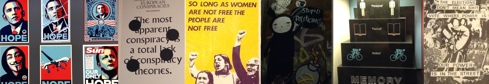

Welcome! I am an Assistant Professor in the [Department of Political Science](http://ps.au.dk/en/) at [Aarhus University](http://www.au.dk/en/). I received my Ph.D. from the [Department of Political Science](http://politicalscience.rice.edu) at Rice University in 2015, and before moving to Aarhus, I was a post-doctoral fellow in the [Department of Political Science](http://www.ipz.uzh.ch/en.html) at University of Zurich. 

I  study Comparative Politics and Political Behavior with a primary focus on how political contexts influence political behavior. As my research links macro-level political contexts to micro-level political behavior, my interests touch on various themes in political psychology, public opinion, political institutions, and elections and parties.

My research questions include: How people (psychologically and psychically) engage and orient themselves in politics; how they process political information; how voters respond to policy initiatives (such as electoral platforms and welfare policy reforms) and assign responsibility to political parties and/or governments; and how different political contexts and information environments influence these processes and outcomes. 

[//]: <> (CV [here](files/cvLee.pdf))