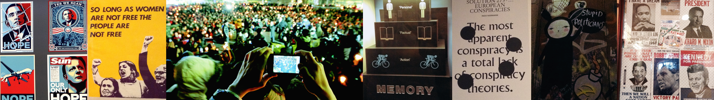
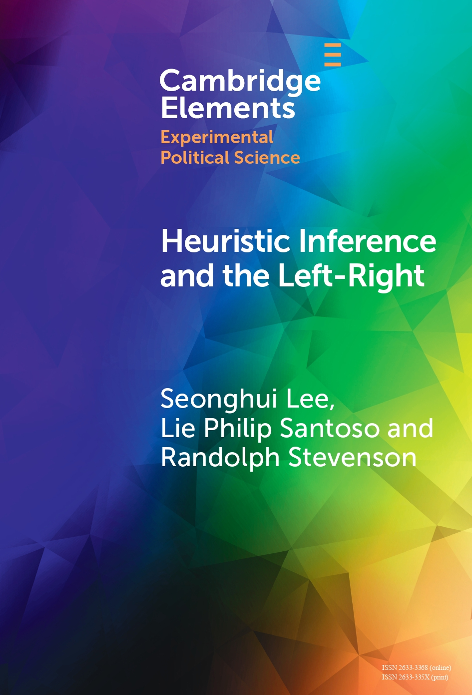

Welcome! I am Associate Research Fellow at the [Institute of Political Science](https://www.ipsas.sinica.edu.tw/en), [Academia Sinica](https://www.sinica.edu.tw/en) (IPSAS). I study comparative political behaviour, political psychology, and public opinion, focusing on how people perceive and make sense of politics, and how political and informational contexts shape such perceptions and citizen behaviors. My research examines questions about political knowledge and citizen competence, the implications of the gender gap in political attitudes and behaviors, and voter reactions to policies and crises from comparative perspectives. My work has been published in the *American Political Science Review*, *British Journal of Political Science*, *Comparative Political Studies*, *Electoral Studies*, *European Journal of Political Science*, *Political Psychology*, *Political Science Research & Methods*, and *West European Politics*, among others.

I am also the co-author of [*Heuristic Inference and the Left-Right: An Experimental Analysis of How Voters Form Their Left-Right Images of Parties*](https://doi.org/10.1017/9781009430807) (Cambridge University Press, 2026), and *Partisan Identity in Multi-Party Democracies* (Cambridge University Press, forthcoming).

 <small> <b> Open Access </b> - Click the image! </small> 

Before joining IPSAS, I worked at the [University of Essex](https://www.essex.ac.uk/departments/government) as a Senior Lecturer (Associate Professor) of Comparative Politics, [Aarhus University](http://www.au.dk/en/) as an Assistant Professor in the [Department of Political Science](http://ps.au.dk/en/), and [University of Zurich](http://www.ipz.uzh.ch/en.html) as a pre-/post-doctoral fellow. I earned my Ph.D. in [Political Science](http://politicalscience.rice.edu) in 2015 from [Rice University](https://www.rice.edu/). See [here](menu/research.html) for more about my published and on-going research projects.

[//]: <> (CV [here](files/cvLee.pdf))
